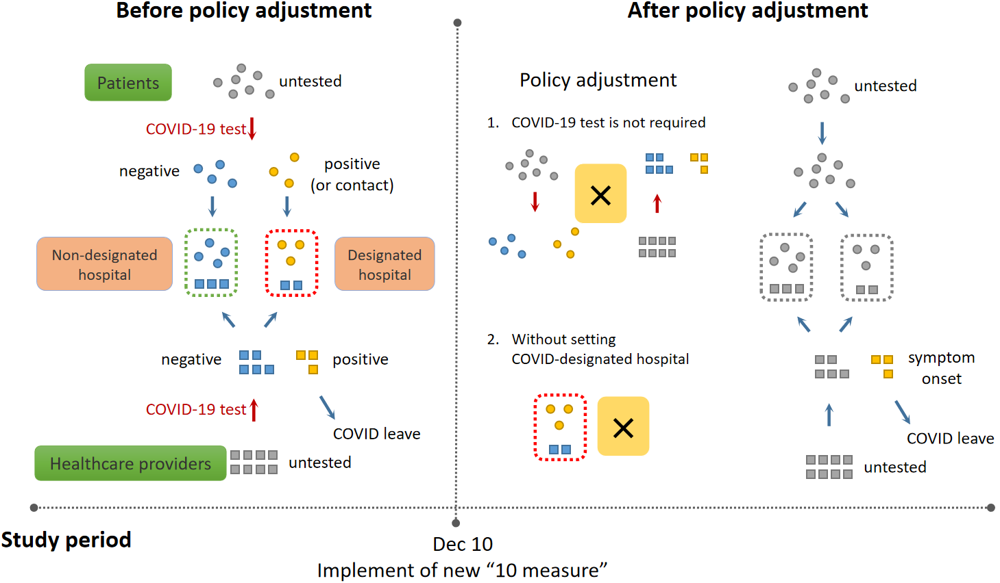
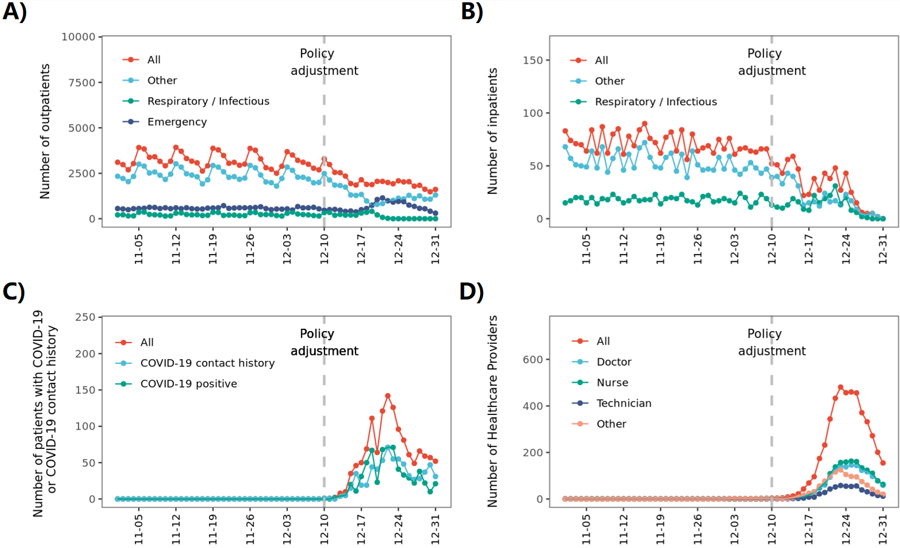

Overview of the study
=============================================
In Dec 2022, the COVID-19 restriction was end.

People raised concerns about potential healthcare system overload due to surging case loads.

We performed this study to evaluate the impact on such a policy adjustment on pediatric healthcare services. 

The data and anaysis procedure are available at below.

Adjustment of healthcare activity
=============================================

After policy adjustment:

- COVID-19 testing is not a necessary for patients and healthcare providers.
- Designation of COVID-19 hospitals were canceled.

Data source and study population
=============================================
This study was conducted using EMR of affilicated children's hosptial of Jiangnan Universit, from Nov 2022 to Dec 2022.

Meterological varaitions were also acquired.  

All personal information data are masked.

You can download the data at `https://github.com/zhanghaoyang0/covid_survey2/blob/main/data/data.rdata`.

Note that the data is rdata. Please see our code about how to use it.  

Preparation for analysis
=============================================
Clone our repository, which contains our data, codes, and plots:

.. code-block:: python

   git clone https://github.com/zhanghaoyang0/covid_survey2.git
   cd covid_survey2

Start R, load data and functions:

.. code-block:: python

   R
   source('./code/prepare.r')
   datas = load('data/data.rdata')
   datas

My environment (not necessary to be the same, but you may check when you encounter issues when running my code):

.. code-block:: python

   sessionInfo()
   # R version 4.2.1 (2022-06-23)
   # Platform: x86_64-conda-linux-gnu (64-bit)
   # Running under: CentOS Linux 7 (Core)
   #
   # attached base packages:
   # [1] stats     graphics  grDevices utils     datasets  methods   base     
   #
   # other attached packages:
   # [1] scales_1.2.1     ggpubr_0.6.0     ggsci_3.0.0      ggplot2_3.4.1   
   # [5] xts_0.12.2       zoo_1.8-11       pracma_2.4.2     stringr_1.5.0   
   # [9] openxlsx_4.2.5.2 dplyr_1.0.10    
   #
   # loaded via a namespace (and not attached):
   # [1] zip_2.2.2        Rcpp_1.0.9       pillar_1.8.1     compiler_4.2.1  
   # [5] tools_4.2.1      lifecycle_1.0.3  tibble_3.1.8     gtable_0.3.1    
   # [9] lattice_0.20-45  pkgconfig_2.0.3  rlang_1.1.0      DBI_1.1.3       
   # [13] cli_3.4.1        withr_2.5.0      generics_0.1.3   vctrs_0.6.1     
   # [17] cowplot_1.1.1    grid_4.2.1       tidyselect_1.2.0 glue_1.6.2      
   # [21] R6_2.5.1         rstatix_0.7.2    fansi_1.0.3      carData_3.0-5   
   # [25] farver_2.1.1     car_3.1-2        tidyr_1.3.0      purrr_1.0.1     
   # [29] magrittr_2.0.3   backports_1.4.1  abind_1.4-5      assertthat_0.2.1
   # [33] colorspace_2.0-3 ggsignif_0.6.4   labeling_0.4.2   utf8_1.2.2      
   # [37] stringi_1.7.8    munsell_0.5.0    broom_1.0.1      crayon_1.5.2    

Patient characteristics
=============================================
Filter data to the period (two weeks around policy adjustment):

.. code-block:: python

   filter_period = function(df, nweek=2){
      out = df%>%filter(DT>=(adjust_day-nweek*7)&DT<(adjust_day+nweek*7))%>%
               mutate(policy = ifelse(DT >= adjust_day, 'After', 'Before'))%>%
               mutate(policy = factor(policy, levels=c('Before', 'After')))
      return(out)
   }

   outpat1 = filter_period(outpat)
   inpat1 = filter_period(inpat)
   
Characteristics of patients:

.. code-block:: python

   des_popChara = function(df){
      out = c()
      for (nweek in c(-2:1, 9)){ # 9 mean full range
         if (nweek==9){start = adjust_day-2*7; end = adjust_day+(1+1)*7} else 
               {start = adjust_day+nweek*7; end = adjust_day+(nweek+1)*7}
         sub = df%>%filter(DT>=start&DT<end)
         n = nrow(sub)
         range = paste0(start, ' to ', end-1)
         age = sprintf('%.2f ± %.2f', mean(sub$age), sd(sub$age))
         n_male = table(sub$SEX)[2]
         n = sprintf('%.0f (%.2f%%)', n, 100*n_male/n)
         out = c(out, range, n, age)
      }
      out = data.frame(matrix(out, ncol=3, byrow=T))
      names(out) = c('range', 'n(male%)', 'age')
      return(out)
   }
   des_popChara(outpat)
   #                         range       n(male%)         age 
   # 1 2022-11-26 to 2022-12-02 21848 (55.90%) 5.39 ± 3.71
   # 2 2022-12-03 to 2022-12-09 21979 (55.87%) 5.47 ± 3.77
   # 3 2022-12-10 to 2022-12-16 17498 (55.02%) 5.73 ± 3.99
   # 4 2022-12-17 to 2022-12-23 13946 (56.09%) 4.72 ± 4.20
   # 5 2022-11-26 to 2022-12-23 75271 (55.72%) 5.37 ± 3.90
   des_popChara(inpat)
   #                         range      n(male%)         age
   # 1 2022-11-26 to 2022-12-02  479 (55.32%) 5.32 ± 3.79
   # 2 2022-12-03 to 2022-12-09  453 (55.41%) 5.36 ± 3.90
   # 3 2022-12-10 to 2022-12-16  330 (53.94%) 5.15 ± 3.94
   # 4 2022-12-17 to 2022-12-23  244 (60.25%) 4.05 ± 4.49
   # 5 2022-11-26 to 2022-12-23 1506 (55.84%) 5.09 ± 4.00

Compare:

.. code-block:: python

   compare_ageSex = function(df, start, end){
      sub = df%>%filter(DT>=as.Date('2022-11-26')&DT<as.Date('2022-12-23'))
      sub1 = sub%>%mutate(group = ifelse(DT>=start&DT<end, 1, 2))
      t = t.test(sub1%>%filter(group==1)%>%pull(age), sub1%>%filter(group==2)%>%pull(age))
      chi = chisq.test(sub1$SEX, sub1$group)
      print(sprintf('t test for age: t = %.2f, p = %.2f', t$statistic, t$p.value))
      print(sprintf('chisquare test for sex: chi = %.2f, p = %.2f', chi$statistic, chi$p.value))
   }
   compare_ageSex(outpat, start = as.Date('2022-12-17'), end = as.Date('2022-12-23'))
   compare_ageSex(inpat, start = as.Date('2022-12-17'), end = as.Date('2022-12-23'))
   # [1] "t test for age: t = -15.57, p = 0.00"
   # [1] "chisquare test for sex: chi = 1.71, p = 0.19"
   # [1] "t test for age: t = -3.54, p = 0.00"
   # [1] "chisquare test for sex: chi = 1.62, p = 0.20"

Time series of hosptial activity
=============================================

Patient visit:

.. code-block:: python

  get_nvisit_bygroup = function(df, date_col, group_col, dates, groups){
      out = c()
      for (day in dates){
         sub = df[df[,date_col] == day, group_col]
         for (group in groups){
            if (group=='All'){num = length(sub)}
            else if (group=='All COVID'){num = sum(sub%in%c('posi', 'contact_posi')); group='All'}
            else if (group=='Other'){num = sum(!sub%in%groups)}
            else if (group=='COVID-19 positive'){num = sum(sub=='posi')}
            else if (group=='COVID-19 contact history'){num = sum(sub=='contact_posi')}
            else {num = sum(sub==group)}
            out = c(out, day, group, num)
         }
      }
      nvisit = data.frame(matrix(out, ncol=3, byrow=T))%>%rename(DT=X1, group=X2, num=X3)%>%
         mutate_if(is_numeric,as.numeric)%>%mutate(DT=as.Date(DT,origin="1970-01-01"))
      return(nvisit)
   }

   # nvist of patient
   groups1 = c('All', 'Other', 'Emergency', 'Respiratory / Infectious')
   groups2 = c('All COVID', 'COVID-19 positive', 'COVID-19 contact history')
   groups3 = c('All', 'Other', 'Respiratory / Infectious')
   nvisit_outpat = get_nvisit_bygroup(outpat, 'DT', 'DPT_NAME', days, groups1)
   nposi_outpat = get_nvisit_bygroup(outpat, 'DT', 'epi', days, groups2)
   nvisit_inpat = get_nvisit_bygroup(inpat, 'DT', 'DPT_NAME', days, groups3)

Healthcare provider on covid leave:

.. code-block:: python

   out = c()
   for (day in days){
      sub = staff%>%filter(start<=day&end>=day)
      for (group in c('All', 'Doctor', 'Nurse', 'Technician', 'Other')){
         if (group=='All'){n=nrow(sub)}else{n = sum(sub$group==group)}
         out = c(out, day, group, n)
      }
   }
   ncovid_staff = data.frame(matrix(out, ncol=3, byrow=T))%>%rename(DT=X1, group=X2, num=X3)%>%
      mutate_if(is_numeric,as.numeric)%>%mutate(DT=as.Date(DT,origin="1970-01-01"))

Reshape data:

.. code-block:: python

   nvisit_outpat1 = reshape(nvisit_outpat, idvar = "DT", timevar = "group", direction = "wide")
   nposi_outpat1 = reshape(nposi_outpat, idvar = "DT", timevar = "group", direction = "wide")
   nvisit_inpat1 = reshape(nvisit_inpat, idvar = "DT", timevar = "group", direction = "wide")
   ncovid_staff1 = reshape(ncovid_staff, idvar = "DT", timevar = "group", direction = "wide")
   nvisit_outpat1%>%merge(nvisit_inpat1, 'DT', all.x=T)%>%merge(nposi_outpat1, 'DT', all.x=T)%>%merge(ncovid_staff1, 'DT', all.x=T)

Correlation between number of COVID-patient and healthcare provider on COVID leave:

.. code-block:: python

   t1 = ncovid_staff1%>%filter(DT>=as.Date('2022-12-10')&DT<as.Date('2022-12-23'))%>%pull(num.All)
   t2 = nposi_outpat1%>%filter(DT>=as.Date('2022-12-10')&DT<as.Date('2022-12-23'))%>%pull(num.All)
   cor.test(t1, t2)
   #         Pearson's product-moment correlation
   # data:  t1 and t2
   # t = 7.7215, df = 11, p-value = 9.134e-06
   # alternative hypothesis: true correlation is not equal to 0
   # 95 percent confidence interval:
   # 0.7450081 0.9758021
   # sample estimates:
   #       cor 
   # 0.9188259 

Compare patient visit before and after policy adjustment:

.. code-block:: python

   compare_nvist = function(df, prefixCol = 'NA'){ # nday is intervel is at day; prefix is first col
      weather1 = weather%>%select(DT, temp_ave, humi_ave)
      df = df%>%merge(weather1, 'DT')
      out = c()
      for (i in unique(df$group)){
         sub = df%>%filter(group==i)
         mod = lm(num ~ policy + temp_ave + humi_ave, data=sub)
         coef = summary(mod)$coefficients
         coef = coef[2, c(1,2,4)]
         coef1 = sprintf('%.2f ± %.2f', coef[1], coef[2]); coef2 = sprintf('%.2f', coef[3])
         temp1 = sub%>%filter(policy=='Before')%>%pull(num); temp2 = sub%>%filter(policy=='After')%>%pull(num)
         mean1 = sprintf('%.2f ± %.2f', mean(temp1), sd(temp1)); mean2 = sprintf('%.2f ± %.2f', mean(temp2), sd(temp2))
         out = c(out, prefixCol, i, mean1, mean2, coef1, coef2)
      }
      res = data.frame(matrix(out, ncol=6, byrow=T))
      names(res) = c('prefix', 'group', 'mean_before', 'mean_after', 'beta', 'p')
      return(res)
   }

   nvisit_inpat1 = filter_period(nvisit_inpat)
   nvisit_outpat1 = filter_period(nvisit_outpat)

   compare_nvist(nvisit_outpat1, 'outpat')
   #   prefix                    group      mean_before       mean_after             beta    p
   # 1 outpat                      All 3130.50 ± 437.79 2246.00 ± 445.91 -566.02 ± 180.07 0.00
   # 2 outpat                    Other 2313.07 ± 365.16 1377.43 ± 546.34 -628.20 ± 196.55 0.00
   # 3 outpat                Emergency   574.93 ± 58.26  647.86 ± 266.47    29.97 ± 93.05 0.75
   # 4 outpat Respiratory / Infectious   241.93 ± 71.68  220.29 ± 125.03    32.98 ± 45.91 0.48

   compare_nvist(nvisit_inpat1, 'inpat')
   #   prefix                    group  mean_before    mean_after          beta    p
   # 1  inpat                      All 66.57 ± 4.35 41.00 ± 12.27 -26.03 ± 4.38 0.00
   # 2  inpat                    Other 48.57 ± 5.02 25.14 ± 11.94 -22.46 ± 4.45 0.00
   # 3  inpat Respiratory / Infectious 18.00 ± 3.82  15.86 ± 6.27  -3.57 ± 2.46 0.16

Plot:

.. code-block:: python
      
   plot_nvist = function(df, groups, ylab_text, legend_pos, legend_col, re_level = F, y_inflat=1){
      df_p = df%>%filter(group%in%groups)
      if (re_level == T){df_p$group = factor(df_p$group, levels = groups)} # level group as groups
      ymax = ceiling(max(df_p$num)/100)*y_inflat*100
      df_text = df_p%>%filter(day==as.Date('2022-12-07'))%>%filter(num==max(num))%>%unique()%>%mutate(num=ymax*0.9)
      days1 = seq(as.Date("2022-11-05"), as.Date("2022-12-31"), by = "1 week")
      p = ggplot(df_p, aes(x=DT, y=num, group=group)) +
         geom_point(aes(color=group)) + geom_line(aes(color=group)) + 
         geom_vline(xintercept=as.Date('2022-12-10'), linetype='dashed', color='gray', size=1) +      
         labs(x=("Date"), y=("Number")) + ylim(0, ymax) + 
         scale_x_date(breaks = days1, date_labels = "%m-%d") +
         geom_text(data=df_text, label=" Policy \n adjustment", vjust=0.5, hjust=0.3, size=3.5) +
         ylab(ylab_text) + xlab('') +
         theme_bw() +
         theme(axis.text.x = element_text(angle = 90, vjust = 0.5, hjust = 1, color="black"), 
               axis.title.y = element_text(size = 10), 
               panel.grid.major=element_blank(),panel.grid.minor=element_blank(), # remove grid
               legend.title=element_blank(), legend.position = c(legend_pos[1], legend_pos[2])) +
         guides(color = guide_legend(ncol = legend_col)) + # legend row
         scale_color_manual(values = pal_npg('nrc')(5)) 
      return(p)
   }

   ylab1 = 'Number of patients with COVID-19 \n or COVID-19 contact history'
   ylab2 = 'Number of Healthcare Providers'
   ylab3 = 'Number of outpatients'
   ylab4 = 'Number of inpatients'
   p1 = plot_nvist(nposi_outpat, c('All', 'COVID-19 positive', 'COVID-19 contact history'), 
      ylab_text=ylab1, legend_pos=c(0.25, 0.77), legend_col=1, y_inflat=1.2)
   p2 = plot_nvist(ncovid_staff, c('All', 'Doctor', 'Nurse', 'Technician', 'Other'), 
      ylab_text=ylab2, legend_pos=c(0.17, 0.67), legend_col=1, re_level=T, y_inflat=1.5)
   p3 = plot_nvist(nvisit_outpat, c('All', 'Other', 'Respiratory / Infectious', 'Emergency'), 
      ylab_text=ylab3, legend_pos=c(0.25, 0.73), legend_col=1, re_level=T, y_inflat=2.4)
   p4 = plot_nvist(nvisit_inpat, c('All', 'Other', 'Respiratory / Infectious'), 
      ylab_text=ylab4, legend_pos=c(0.25, 0.78), legend_col=1, y_inflat=1.65)
   p = ggarrange(p1, p2, p3, p4, ncol=2, nrow=2, common.legend=F, align = "hv", hjust=0.1, vjust=0.1) +
      theme(plot.margin = unit(c(0,0,0,0), "cm"))
   png('./plot/ts_nvist.png',height=900, width=1500, res=150)
   print(p)
   dev.off()

Visiting reason and hospitalization fee
=============================================

Proportion of disease:

.. code-block:: python

   get_prop = function(df){
      out = c()
      for (i in unique(df$policy)){
         sub = df%>%filter(policy==i)
         for (j in unique(sub$DIS)){
            n = sum(sub$DIS==j)
            prop = n/nrow(sub)
            out = c(out, i, j, n, prop)
         }
      }
      res = data.frame(matrix(out, ncol=4, byrow=T))%>%mutate_if(is_numeric,as.numeric)%>%
         rename(policy=X1, group=X2, n=X3, prop=X4) 
      return(res)
   }

   get_propAfterDrop = function(df, levels){
      df1 = df%>%filter(DIS%in%levels)
      df2 = get_prop(df1)
      df2 = df2%>%mutate(group=factor(group, levels=levels))
      return(df2)
   }

   outpat2 = get_prop(outpat1)
   inpat2 = get_prop(inpat1)
   outpat3 = outpat2%>%mutate(prop1=sprintf('%.0f (%.2f%%)', n, prop*100))
   inpat3 = inpat2%>%mutate(prop1=sprintf('%.0f (%.2f%%)', n, prop*100))
   outpat3
   #    policy            group     n        prop          prop1
   # 1  Before            Other 21600 0.492846875 21600 (49.28%)
   # 2  Before       Bronchitis  5698 0.130011180  5698 (13.00%)
   # 3  Before         Allergic  2342 0.053437379   2342 (5.34%)
   # 4  Before             URTI  7765 0.177173888  7765 (17.72%)
   # 5  Before             Oral  1982 0.045223264   1982 (4.52%)
   # 6  Before        Pneumonia  1627 0.037123235   1627 (3.71%)
   # 7  Before    Ophthalmology  1853 0.042279873   1853 (4.23%)
   # 8  Before Neuropsychiatric   530 0.012093002    530 (1.21%)
   # 9  Before         Neonatal   430 0.009811304    430 (0.98%)
   # 10  After             URTI  9983 0.317485053  9983 (31.75%)
   # 11  After            Other 12233 0.389040834 12233 (38.90%)
   # 12  After       Bronchitis  3734 0.118750795  3734 (11.88%)
   # 13  After        Pneumonia  1679 0.053396514   1679 (5.34%)
   # 14  After         Neonatal   239 0.007600814    239 (0.76%)
   # 15  After             Oral   971 0.030880295    971 (3.09%)
   # 16  After    Ophthalmology  1019 0.032406818   1019 (3.24%)
   # 17  After         Allergic  1012 0.032184200   1012 (3.22%)
   # 18  After Neuropsychiatric   574 0.018254675    574 (1.83%)
   inpat3
   #    policy            group   n        prop        prop1
   # 1   After Neuropsychiatric  44 0.076655052   44 (7.67%)
   # 2   After        Pneumonia 200 0.348432056 200 (34.84%)
   # 3   After         Neonatal  47 0.081881533   47 (8.19%)
   # 4   After            Other 216 0.376306620 216 (37.63%)
   # 5   After       Bronchitis  34 0.059233449   34 (5.92%)
   # 6   After             URTI  16 0.027874564   16 (2.79%)
   # 7   After             Oral  13 0.022648084   13 (2.26%)
   # 8   After         Allergic   3 0.005226481    3 (0.52%)
   # 9   After    Ophthalmology   1 0.001742160    1 (0.17%)
   # 10 Before Neuropsychiatric  34 0.036480687   34 (3.65%)
   # 11 Before            Other 426 0.457081545 426 (45.71%)
   # 12 Before         Neonatal  42 0.045064378   42 (4.51%)
   # 13 Before        Pneumonia 334 0.358369099 334 (35.84%)
   # 14 Before       Bronchitis  48 0.051502146   48 (5.15%)
   # 15 Before             Oral  32 0.034334764   32 (3.43%)
   # 16 Before         Allergic   8 0.008583691    8 (0.86%)
   # 17 Before             URTI   3 0.003218884    3 (0.32%)
   # 18 Before    Ophthalmology   5 0.005364807    5 (0.54%)

Compare visiting reason:

.. code-block:: python

   # chisquare
   sub1 = outpat1%>%filter(DIS%in%c('Bronchitis', 'URTI', 'Pneumonia'))
   sub2 = inpat1%>%filter(DIS%in%c('Bronchitis', 'URTI', 'Pneumonia'))
   with(sub1, chisq.test(DIS, policy))
   #         Pearson's Chi-squared test
   # data:  DIS and policy
   # X-squared = 683.96, df = 2, p-value < 2.2e-16

   with(sub2, chisq.test(DIS, policy))
   #      Pearson's Chi-squared test
   # data:  DIS and policy
   # X-squared = 16.977, df = 2, p-value = 0.0002058

Measure hosptialization fee:

.. code-block:: python
   # recode fee col
   inpat_fee2 = inpat1%>%mutate(DPT_NAME=ifelse(DPT_NAME=='Respiratory / Infectious', 'Respiratory / Infectious', 'Other'))
   fee_cols = get('FEE', names(inpat1))
   fee_cols1 = c() # fee > 5%
   for (i in unique(inpat_fee2$policy)){
      for (j in unique(inpat_fee2$DPT_NAME)){
         sub = inpat_fee2%>%filter(policy==i&DPT_NAME==j)
         for (k in fee_cols){
               temp = sub[,k]
               prop = sum(temp)/sum(sub[, fee_cols])
               if (prop>0.05){fee_cols1 = c(fee_cols1, k)}
         }  
      }
   }
   fee_cols1 = unique(c(fee_cols1, 'OTHER_FEE')) # > 5% in either group
   fee_cols2 = fee_cols[!fee_cols%in%fee_cols1] # merge to other
   # fee prop
   out = c()
   for (i in unique(inpat_fee2$policy)){
      for (j in unique(inpat_fee2$DPT_NAME)){
         sub = inpat_fee2%>%filter(policy==i&DPT_NAME==j)      
         sub$OTHER_FEE = rowSums(sub[, c(fee_cols2, 'OTHER_FEE')])
         for (k in c(fee_cols1)){
               temp = sub[,k]
               mean = sprintf('%.2f±%.2f', mean(temp), sd(temp))
               prop = sum(temp)/sum(sub[,fee_cols1])
               out = c(out, i, j, k, mean, prop)
         }
      }
   }
   fee_prop = data.frame(matrix(out, ncol=5, byrow=T))%>%mutate_if(is_numeric,as.numeric)%>%
      rename(policy=X1, dpt=X2, group=X3, mean=X4, prop=X5)
   key = c('NURSING_FEE', 'LAB_DIAG_FEE', 'IMAG_DIAG_FEE', 'OP_T_FEE', 'W_MED_FEE', 'DMM_FEE', 'GEN_MED_FEE', 'OTHER_FEE')
   value = c('Nursing', 'Laboratory', 'Imaging', 'Surgery', 'Drug', 'Material', 'General', 'Other')
   map = data.frame(group=key, group_new=value)
   fee_prop = fee_prop%>%merge(map, 'group')%>%mutate(group=group_new)%>%select(-group_new)%>%
      mutate(group=factor(group, levels=c('Laboratory', 'Imaging', 'Nursing', 'Drug', 'Surgery', 'Material', 'General', 'Other'))) # rename fee
   fee_prop
   # 1    Material  After                    Other 1358.40±3294.39 0.186428755
   # 2    Material  After Respiratory / Infectious   192.22±250.20 0.046265799
   # 3    Material Before                    Other 1694.00±5184.38 0.212011876
   # 4    Material Before Respiratory / Infectious   259.80±286.18 0.046735709
   # 5     General  After                    Other   913.32±827.04 0.125344563
   # 6     General  After Respiratory / Infectious   753.73±420.66 0.181419713
   # 7     General Before                    Other   998.33±979.02 0.124945882
   # 8     General Before Respiratory / Infectious   946.83±527.21 0.170327508
   # 9     Imaging  After                    Other   415.39±563.37 0.057009238
   # 10    Imaging  After Respiratory / Infectious   160.70±299.60 0.038679363
   # 11    Imaging Before                    Other   505.44±632.48 0.063258265
   # 12    Imaging Before Respiratory / Infectious   313.27±244.97 0.056355800
   # 13 Laboratory  After                    Other 1692.48±1098.88 0.232277705
   # 14 Laboratory  After Respiratory / Infectious  1957.77±794.31 0.471227948
   # 15 Laboratory Before                    Other 1810.75±1257.46 0.226624319
   # 16 Laboratory Before Respiratory / Infectious  2477.51±882.47 0.445686608
   # 17    Nursing  After                    Other   357.05±343.58 0.049002146
   # 18    Nursing  After Respiratory / Infectious    268.10±92.35 0.064530297
   # 19    Nursing Before                    Other   388.17±490.95 0.048581798
   # 20    Nursing Before Respiratory / Infectious    318.90±99.85 0.057368769
   # 21    Surgery  After                    Other  673.66±1782.38 0.092454326
   # 22    Surgery  After Respiratory / Infectious      9.91±47.48 0.002385273
   # 23    Surgery Before                    Other  761.90±1793.61 0.095355163
   # 24    Surgery Before Respiratory / Infectious      9.83±52.14 0.001767521
   # 25      Other  After                    Other  653.49±1126.88 0.089685137
   # 26      Other  After Respiratory / Infectious   190.57±357.75 0.045869280
   # 27      Other Before                    Other  642.78±1735.87 0.080447655
   # 28      Other Before Respiratory / Infectious   391.66±430.96 0.070456828
   # 29       Drug  After                    Other 1222.65±1947.70 0.167798130
   # 30       Drug  After Respiratory / Infectious   621.62±916.90 0.149622327
   # 31       Drug Before                    Other 1188.73±1985.41 0.148775042
   # 32       Drug Before Respiratory / Infectious   841.06±658.36 0.151301256

Compare hosptialization fee and length:

.. code-block:: python
   dpts = c('Total', "Gastroenterology", "Neonatology", "Neurology", "Nephropathy", "Cardiology", "Respiratory / Infectious") # dpt with patients > 100
   inpat2 = rbind(inpat1, inpat1%>%mutate(DPT_NAME='Total')) # double df to add total
   inpat2 = inpat2%>%mutate(DPT_NAME = ifelse(DPT_NAME%in%dpts, DPT_NAME, 'Other'))

   desReg = function(df, col){
      df$y = df[,col]
      var1 = df%>%filter(policy=='Before')%>%pull(y)
      var2 = df%>%filter(policy=='After')%>%pull(y)
      mean1 = sprintf('%.2f ± %.2f', mean(var1), sd(var1))
      mean2 = sprintf('%.2f ± %.2f', mean(var2), sd(var2))
      lm = lm(y~policy+age+SEX, df)
      coef = summary(lm)$coefficients[2,]
      beta = sprintf('%.2f ± %.2f', coef[1], coef[2])
      p = sprintf('%.2f', coef[4])
      out = c(col, mean1, mean2, beta, p)
      return(out)
   }

   out = c()
   for (dpt in c(dpts, 'Other')){
      for (col in c('TOTAL_COST', 'hosp_day')){
         sub = inpat2%>%filter(DPT_NAME==dpt)%>%select(policy, age, SEX, TOTAL_COST, hosp_day)
         reg = desReg(sub, col)
         out = c(out, dpt, reg)
      }
   }

   reg = data.frame(matrix(out, ncol=6, byrow=T)); names(reg) = c('dpt', 'col', 'mean_before', 'mean_after', 'beta', 'p')
   reg
   #                        dpt        col         mean_before        mean_after               beta    p
   # 1                     Total TOTAL_COST   7353.74 ± 8772.13 6096.70 ± 5976.90  -1172.51 ± 415.78 0.00
   # 2                     Total   hosp_day         5.81 ± 3.40       5.02 ± 2.41       -0.79 ± 0.16 0.00
   # 3          Gastroenterology TOTAL_COST   4764.07 ± 2205.12 5275.82 ± 2459.89    485.24 ± 500.23 0.33
   # 4          Gastroenterology   hosp_day         5.04 ± 2.19       4.72 ± 2.10       -0.05 ± 0.43 0.90
   # 5               Neonatology TOTAL_COST 10515.75 ± 10038.87 6126.03 ± 3500.30 -4431.31 ± 1425.82 0.00
   # 6               Neonatology   hosp_day         7.34 ± 5.76       4.47 ± 1.84       -2.83 ± 0.83 0.00
   # 7                 Neurology TOTAL_COST   5061.65 ± 2242.00 4596.72 ± 3045.49   -561.73 ± 503.12 0.27
   # 8                 Neurology   hosp_day         6.01 ± 1.98       5.18 ± 2.63       -0.89 ± 0.43 0.04
   # 9               Nephropathy TOTAL_COST   4765.68 ± 2906.16 4861.61 ± 3070.73    145.95 ± 583.03 0.80
   # 10              Nephropathy   hosp_day         5.27 ± 3.36       5.05 ± 3.15       -0.07 ± 0.62 0.92
   # 11               Cardiology TOTAL_COST   5658.73 ± 4206.42 6542.74 ± 5794.85    866.11 ± 913.81 0.35
   # 12               Cardiology   hosp_day         5.68 ± 1.58       5.42 ± 1.72       -0.26 ± 0.31 0.42
   # 13 Respiratory / Infectious TOTAL_COST   5558.86 ± 2014.49 4170.96 ± 2203.60  -1269.14 ± 192.34 0.00
   # 14 Respiratory / Infectious   hosp_day         5.70 ± 1.72       4.90 ± 1.55       -0.77 ± 0.15 0.00
   # 15                    Other TOTAL_COST 10570.87 ± 13496.95 9862.44 ± 9658.38  -678.49 ± 1248.97 0.59
   # 16                    Other   hosp_day         5.93 ± 4.48       5.30 ± 3.40       -0.62 ± 0.42 0.14

Plot proportion of visiting reason:

.. code-block:: python

   plot_prop = function(df, title, nrow_legend=2){
      p = ggplot(df, aes(x = policy, weight = prop, fill = group))+
         geom_bar(position = "stack") +
         xlab('') + ylab('') + labs(fill = '') +
         theme(plot.title = element_text(size = 12, hjust = 0.5),
               axis.text.y = element_text(color="black"), 
               legend.position="none", legend.title=element_blank(),
               legend.text = element_text(size = 8)) +
         ggtitle(title) +
         coord_flip() +
         guides(fill=guide_legend(title="", nrow = nrow_legend)) + # legend row
         scale_fill_nejm()
      return(p)
   }

   levels1 = c('Pneumonia', 'URTI','Bronchitis')
   levels2 = c('Neonatal','Allergic','Oral','Ophthalmology','Neuropsychiatric')
   outpat3 = get_propAfterDrop(outpat1, levels1)
   inpat3 = get_propAfterDrop(inpat1, levels1)
   outpat4 = get_propAfterDrop(outpat1, levels2)
   inpat4 = get_propAfterDrop(inpat1, levels2)

   # group with levels1
   plots  = list()
   plots[[1]] = plot_prop(outpat3, 'Proportion of Main Respiratory Diseases (Outpatient)', nrow_legend=3)
   plots[[2]] = plot_prop(inpat3, 'Proportion of Main Respiratory Diseases (Inpatient)', nrow_legend=3)
   plots[[3]] = plot_prop(outpat4, 'Proportion of Main Respiratory Diseases (Outpatient)', nrow_legend=5)
   plots[[4]] = plot_prop(inpat4, 'Proportion of Main Respiratory Diseases (Inpatient)', nrow_legend=5)

   p1 = ggarrange(plots[[1]], plots[[2]], hjust=0.1, vjust=0.1, ncol=1, nrow=2, common.legend=T, legend="right")
   p2 = ggarrange(plots[[3]], plots[[4]], hjust=0.1, vjust=0.1, ncol=1, nrow=2, common.legend=T, legend="right")

   png('./plot/dis_prop1.png',height=500, width=1000, res=150)
   print(p1)
   dev.off()
   png('./plot/dis_prop2.png',height=500, width=1000, res=150)
   print(p2)
   dev.off()

Plot proportion of hosptialization fee:

.. code-block:: python

   plots  = list()
   for (i in unique(fee_prop$dpt)){
      title = ifelse(i=='Other', 'Proportion of Hospitalization Expenses on Respiratory / Infectious Diseases', 
         'Proportion of Hospitalization Expenses on Other Diseases')
      df_p1 = fee_prop%>%filter(dpt==i)
      p = plot_prop(df_p1, title, nrow_legend=8)
      plots[[i]] = p 
   }
   p <- ggarrange(plots[[1]], plots[[2]], hjust=0.1, vjust=0.1, ncol=1, nrow=2, common.legend=T, legend="right")
   png('./plot/fee_prop.png',height=500, width=1500, res=150)
   print(p)
   dev.off()

Workload of healthcare provider
=======================

Compare workload of healthcare provider:

.. code-block:: python
      
   cal_workload = function(df, col, name){
      tab = table(df[,col], df$policy)
      out = data.frame(cbind(name, rbind(cbind('Before', tab[,1]), cbind('After', tab[,2]))))
      out = out%>%rename(policy=V2, n=V3)%>%mutate(n=as.numeric(n)/2)%>%filter(n>0) # divide length of period
      row.names(out) = NULL
      return(out)
   }

   compare_workload = function(df, col, name){
      out = cal_workload(df, col, name)
      n1 = out%>%filter(policy=='Before')%>%pull(n)
      n2 = out%>%filter(policy=='After')%>%pull(n)
      test = t.test(n1, n2)
      mean1 = sprintf('%.2f ± %.2f', mean(n1), sd(n1))
      mean2 = sprintf('%.2f ± %.2f', mean(n2), sd(n2))
      stat = c(col, mean1, mean2, test$statistic, test$p.value)
      names(stat) = c('var', 'mean_before', 'mean_after', 't', 'p')
      return(stat)
   }

   dpts = c('all', 'other', 'Respiratory / Infectious')
   compare = data.frame()
   for (dpt in dpts){
      if (dpt=='Respiratory / Infectious'){outpat2 = outpat1%>%filter(DPT_NAME==dpt); inpat2 = inpat1%>%filter(DPT_NAME==dpt)}
      if (dpt=='all'){outpat2 = outpat1; inpat2 = inpat1}
      if (dpt=='other'){outpat2 = outpat1%>%filter(DPT_NAME!='Respiratory / Infectious'); inpat2 = inpat1%>%filter(DPT_NAME!='Respiratory / Infectious')}
      sub1 = compare_workload(outpat2, 'DOC_NAME', 'Doctor')
      sub2 = compare_workload(inpat2, 'HPHY_NAME', 'Doctor')
      sub3 = compare_workload(inpat2, 'OP_DOC_NAME', 'Surgery doctor')
      sub4 = compare_workload(inpat2, 'PRIMARY_NUR', 'Nurse')
      sub = data.frame(rbind(sub1, sub2, sub3, sub4))
      sub = cbind(dpt, sub)
      compare = rbind(compare, sub)   
   }
   row.names(compare) = NULL
   compare
   #                           dpt         var   mean_before    mean_after                 t                    p
   # 1                       all    DOC_NAME 89.08 ± 81.07 63.91 ± 74.74  3.58012224895312 0.000377886431007281
   # 2                       all   HPHY_NAME   6.21 ± 6.76   4.42 ± 5.19  1.77733084958176   0.0777478951499102
   # 3                       all OP_DOC_NAME   2.18 ± 2.01   1.40 ± 1.08  2.43871012921105    0.016690976651954
   # 4                       all PRIMARY_NUR 15.03 ± 12.59 10.63 ± 11.04  1.41884238570103    0.161487382188313
   # 5                     other    DOC_NAME 82.53 ± 77.44 58.35 ± 68.87  3.64482159126027  0.00029676006040416
   # 6                     other   HPHY_NAME   5.23 ± 5.11   3.09 ± 3.09  2.84203999269058    0.005366639848032
   # 7                     other OP_DOC_NAME   2.12 ± 2.05   1.55 ± 1.10  1.68328116994069   0.0959921935710756
   # 8                     other PRIMARY_NUR 13.60 ± 11.93   6.77 ± 6.42  2.53142005076924   0.0158020845226612
   # 9  Respiratory / Infectious    DOC_NAME 33.21 ± 45.19 29.09 ± 34.63 0.519404051621519    0.604703796031815
   # 10 Respiratory / Infectious   HPHY_NAME 11.45 ± 11.65   5.55 ± 7.36  1.52154594149346    0.149619274720804
   # 11 Respiratory / Infectious OP_DOC_NAME   2.00 ± 0.91   0.50 ± 0.00    3.286335345031   0.0462050913533633
   # 12 Respiratory / Infectious PRIMARY_NUR 18.00 ± 15.39 11.10 ± 16.17 0.890835661872633    0.388630575431416

Comments and feedbacks
=======================

Feel free to contact me via zhanghaoyang0@hotmail.com.  

You may star the project at https://github.com/zhanghaoyang0/covid_survey2.  

