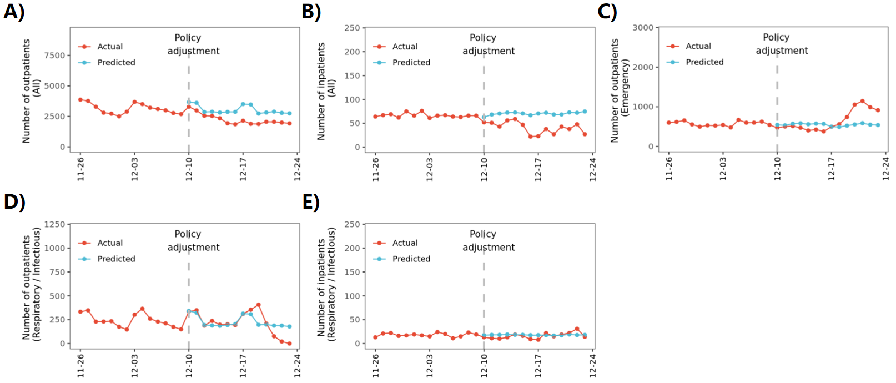
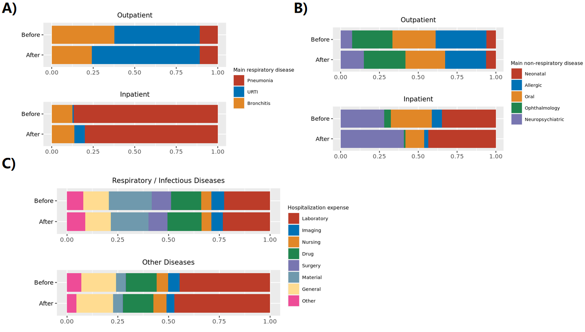

Overview
=============================================
In Dec 2022, the COVID-19 restriction was end.

People raised concerns about potential healthcare system overload due to surging case loads.

We used EMR data from affilicated children's hosptial of Jiangnan University, to evaluate the impact on such a policy adjustment on our pediatric healthcare services. 

The data and anaysis procedure are available at below.

Healthcare activity
=============================================

.. image:: fig1.png
   :width: 600
   :align: center

China made significant policy changes with "10 measures" (released in Dec 7th and implemented in Dec 10th), which relaxed some of the strict testing requirements for healthcare services.

Healthcare activity before and after are summrized in the figure.

Data
=============================================
This study was conducted using EMR of our hospital, from Nov 2022 to Dec 2022 of patients who attended our hospital.

Meterological varaitions were also acquired and provided.  

All personal information data are masked.

You can download the data at `https://github.com/zhanghaoyang0/covid_survey2/blob/main/data/data.rdata`.

Note that the data is rdata. Please see our code about how to use it.  

Analysis: preparation
=============================================
clone our repository, which contains our data, codes, and plots:

.. code-block:: python

   git clone https://github.com/zhanghaoyang0/covid_survey2.git
   cd covid_survey2

start R, load data and functions:

.. code-block:: python

   R
   source('./code/prepare.r')
   datas = load('data/data.rdata')
   datas

Patient characteristics
=============================================
filter data to the period (two weeks around policy adjustment):

.. code-block:: python

   filter_period = function(df, nweek=2){
      out = df%>%filter(DT>=(adjust_day-nweek*7)&DT<(adjust_day+nweek*7))%>%
               mutate(policy = ifelse(DT >= adjust_day, 'After', 'Before'))%>%
               mutate(policy = factor(policy, levels=c('Before', 'After')))
      return(out)
   }

   outpat1 = filter_period(outpat)
   inpat1 = filter_period(inpat)
   

characteristics of patients:

.. code-block:: python

   des_popChara = function(df){
      out = c()
      for (nweek in c(-2:1, 9)){ # 9 mean full range
         if (nweek==9){start = adjust_day-2*7; end = adjust_day+(1+1)*7} else 
               {start = adjust_day+nweek*7; end = adjust_day+(nweek+1)*7}
         sub = df%>%filter(DT>=start&DT<end)
         n = nrow(sub)
         range = paste0(start, ' to ', end-1)
         age = sprintf('%.2f ± %.2f', mean(sub$age), sd(sub$age))
         n_male = table(sub$SEX)[2]
         n = sprintf('%.0f (%.2f%%)', n, 100*n_male/n)
         out = c(out, range, n, age)
      }
      out = data.frame(matrix(out, ncol=3, byrow=T))
      names(out) = c('range', 'n(male%)', 'age')
      return(out)
   }

   des_popChara(outpat)
   ..                         range       n(male%)         age 
   .. 1 2022-11-26 to 2022-12-02 21848 (55.90%) 5.39 ± 3.71
   .. 2 2022-12-03 to 2022-12-09 21979 (55.87%) 5.47 ± 3.77
   .. 3 2022-12-10 to 2022-12-16 17498 (55.02%) 5.73 ± 3.99
   .. 4 2022-12-17 to 2022-12-23 13946 (56.09%) 4.72 ± 4.20
   .. 5 2022-11-26 to 2022-12-23 75271 (55.72%) 5.37 ± 3.90
   des_popChara(inpat)
   ..                         range      n(male%)         age
   .. 1 2022-11-26 to 2022-12-02  479 (55.32%) 5.32 ± 3.79
   .. 2 2022-12-03 to 2022-12-09  453 (55.41%) 5.36 ± 3.90
   .. 3 2022-12-10 to 2022-12-16  330 (53.94%) 5.15 ± 3.94
   .. 4 2022-12-17 to 2022-12-23  244 (60.25%) 4.05 ± 4.49
   .. 5 2022-11-26 to 2022-12-23 1506 (55.84%) 5.09 ± 4.00

compare:

.. code-block:: python

   compare_ageSex = function(df, start, end){
      sub = df%>%filter(DT>=as.Date('2022-11-26')&DT<as.Date('2022-12-23'))
      sub1 = sub%>%mutate(group = ifelse(DT>=start&DT<end, 1, 2))
      t = t.test(sub1%>%filter(group==1)%>%pull(age), sub1%>%filter(group==2)%>%pull(age))
      chi = chisq.test(sub1$SEX, sub1$group)
      print(sprintf('t test for age: t = %.2f, p = %.2f', t$statistic, t$p.value))
      print(sprintf('chisquare test for sex: chi = %.2f, p = %.2f', chi$statistic, chi$p.value))
   }

   compare_ageSex(outpat, start = as.Date('2022-12-17'), end = as.Date('2022-12-23'))
   compare_ageSex(inpat, start = as.Date('2022-12-17'), end = as.Date('2022-12-23'))
   # [1] "t test for age: t = -15.57, p = 0.00"
   .. [1] "chisquare test for sex: chi = 1.71, p = 0.19"
   .. [1] "t test for age: t = -3.54, p = 0.00"
   .. [1] "chisquare test for sex: chi = 1.62, p = 0.20"

Time series of hosptial activity
=============================================

.. image:: fig2.png
   :width: 600
   :align: center
   

daily number of patient visit:
.. code-block:: python

  get_nvisit_bygroup = function(df, date_col, group_col, dates, groups){
      out = c()
      for (day in dates){
         sub = df[df[,date_col] == day, group_col]
         for (group in groups){
            if (group=='All'){num = length(sub)}
            else if (group=='All COVID'){num = sum(sub%in%c('posi', 'contact_posi')); group='All'}
            else if (group=='Other'){num = sum(!sub%in%groups)}
            else if (group=='COVID-19 positive'){num = sum(sub=='posi')}
            else if (group=='COVID-19 contact history'){num = sum(sub=='contact_posi')}
            else {num = sum(sub==group)}
            out = c(out, day, group, num)
         }
      }
      nvisit = data.frame(matrix(out, ncol=3, byrow=T))%>%rename(DT=X1, group=X2, num=X3)%>%
         mutate_if(is_numeric,as.numeric)%>%mutate(DT=as.Date(DT,origin="1970-01-01"))
      return(nvisit)
   }

   sort(table(outpat$DPT_NAME), decreasing=T)
   sort(table(inpat$DPT_NAME), decreasing=T)

   # nvist of patient
   groups1 = c('All', 'Other', 'Emergency', 'Respiratory / Infectious')
   groups2 = c('All COVID', 'COVID-19 positive', 'COVID-19 contact history')
   groups3 = c('All', 'Other', 'Respiratory / Infectious')
   nvisit_outpat = get_nvisit_bygroup(outpat, 'DT', 'DPT_NAME', days, groups1)
   nposi_outpat = get_nvisit_bygroup(outpat, 'DT', 'epi', days, groups2)
   nvisit_inpat = get_nvisit_bygroup(inpat, 'DT', 'DPT_NAME', days, groups3)

daily number of healthcare provider on covid leave:

.. code-block:: python

   out = c()
   for (day in days){
      sub = staff%>%filter(start<=day&end>=day)
      for (group in c('All', 'Doctor', 'Nurse', 'Technician', 'Other')){
         if (group=='All'){n=nrow(sub)}else{n = sum(sub$group==group)}
         out = c(out, day, group, n)
      }
   }
   ncovid_staff = data.frame(matrix(out, ncol=3, byrow=T))%>%rename(DT=X1, group=X2, num=X3)%>%
      mutate_if(is_numeric,as.numeric)%>%mutate(DT=as.Date(DT,origin="1970-01-01"))

reshape data:

.. code-block:: python
   nvisit_outpat1 = reshape(nvisit_outpat, idvar = "DT", timevar = "group", direction = "wide")
   nposi_outpat1 = reshape(nposi_outpat, idvar = "DT", timevar = "group", direction = "wide")
   nvisit_inpat1 = reshape(nvisit_inpat, idvar = "DT", timevar = "group", direction = "wide")
   ncovid_staff1 = reshape(ncovid_staff, idvar = "DT", timevar = "group", direction = "wide")
   nvisit_outpat1%>%merge(nvisit_inpat1, 'DT', all.x=T)%>%merge(nposi_outpat1, 'DT', all.x=T)%>%merge(ncovid_staff1, 'DT', all.x=T)
   # write.csv(temp, './temp.csv', quote=F, row.names=F)

   t1 = ncovid_staff1%>%filter(DT>=as.Date('2022-12-10')&DT<as.Date('2022-12-23'))%>%pull(num.All)
   t2 = nposi_outpat1%>%filter(DT>=as.Date('2022-12-10')&DT<as.Date('2022-12-23'))%>%pull(num.All)

   cor.test(t1, t2)

Vaccination:

.. code-block:: python

   df[df$how_long_lastvac=='', 'n_vac'] = '0' # if a person report n_vac but not how_long_lastvac, treat n_vac as NA
   df = df%>%mutate(n_vac=ifelse(n_vac%in%c(3, 4), '≥3', n_vac))%>%
      mutate(n_vac=factor(n_vac, levels=c('0', '1', '2', '≥3')))

   df = df%>%mutate(how_long_lastvac=ifelse(how_long_lastvac=='', 'no_vac', how_long_lastvac))%>%
      mutate(how_long_lastvac=gsub('个月', ' month', how_long_lastvac))%>%
      mutate(how_long_lastvac=ifelse(how_long_lastvac%in%c('<3 month', '3-6 month'), '<6 month', how_long_lastvac))%>%
      mutate(how_long_lastvac=factor(how_long_lastvac, levels=c('no_vac', '<6 month', '6-12 month', '>12 month')))

   get_prop(df, 'sex', 'n_vac')
   get_prop(df, 'sex', 'how_long_lastvac')

Medication:

.. code-block:: python

   # the 'drug_use' have been grouped to four groups, by hand
   drugs = c('ibuprofen_use', 'acetaminophen_use', 'chnmed_use')
   df[, drugs][is.na(df[, drugs])] = 0
   for (drug in drugs){
      print(drug)
      get_prop(df, 'sex', drug)
      df[,drug] = as.factor(df[,drug])
   }

Calculate syndrome score with symptom score, normalize to 0-1:

.. code-block:: python

   ## calculate syndrome score with symptom score, normalize to 0-1
   syndromes = unique(dict2$syndrome)
   symptoms = list()
   for (i in syndromes){
      symptoms[[i]] = dict2%>%filter(syndrome==i)%>%pull(item_eng)
   }
   print(symptoms)
   print(sum(is.na(df[,unlist(symptoms)]))) # number of NA
   for (syndrome in syndromes){
      score = rowSums(df[,symptoms[[syndrome]]])/length(symptoms[[syndrome]])/3 # normalize to 0-1
      df[,paste0(syndrome, '_score')] = score
   }

Region:

.. code-block:: python

   ## region
   df$region = gsub('维吾尔|壮族', '', df$region)
   regions = c()
   for (i in 1:nrow(df)){
      item = df[i, 'region']
      item1 = strsplit(item, '自治区|自治州|特别行政区|省|市')[[1]][1]
      regions = c(regions, item1)
   }
   df$region = regions
   # replace chn with pinyin
   data(china)
   china = china%>%mutate(region=gsub('省|市|回族|壮族|维吾尔|特别行政区|自治区', '', Name_Province))
   china = china%>%group_by(region)%>%dplyr::summarise(geometry=st_union(geometry))
   replace = data.frame(region=china$region, 
   region1 = c('Shanghai', 'Yunnan', 'Neimenggu', 'Beijing', 'Taiwan', 'Jilin', 'Sichuan', 'Tianji', 
   'Ningxia', 'Anhui', 'Shandong', 'Shānxi', 'Guangdong', 'Guangxi', 'Xinjiang', 'Jiangsu', 'Jiangxi', 'Hebei', 
   'Henan', 'Zhejiang', 'Hainan', 'Hubei', 'Hunan', 'Macau', 'Gansu', 'Fujian', 'Tibet', 'Guizhou', 'Liaoning', 
   'Chongqing', 'Shǎnxi', 'Qinghai', 'Hong Kong', 'Heilongjiang'))
   china = china%>%merge(replace, 'region')%>%select(-region)%>%rename(region=region1)
   df = df%>%merge(replace, 'region')%>%select(-region)%>%rename(region=region1)
   print(table(df$region))
   # sample size for each region
   tab = table(df$region)
   tab = data.frame(cbind(names(tab), tab))
   pop_tab = tab%>%rename(n=tab, region=V1)%>%mutate(n=as.numeric(n))%>%arrange(n)
   print(pop_tab)

Analysis: distribution of symptom serverity
=============================================

Bar plot for servere of sympytoms:

.. image:: fig1.png
   :width: 600
   :align: center

.. code-block:: python

   map = data.frame(score=c(0:3), score1=c('Absent', 'Mild', 'Moderate', 'Severe'))
   out = c()
   for (i in unlist(symptoms)){
      for (j in c(0:3)){
         prop = sum(df[,i]==j)/nrow(df)
         out = c(out, i, j, prop)
      }
   }
   df_p = data.frame(matrix(out, ncol=3, byrow=T))
   df_p = df_p%>%mutate_if(is_numeric,as.numeric)%>%rename(sympton=X1, score=X2, prop=X3)
   df_p = df_p%>%merge(map, 'score')%>%mutate(score1=factor(score1, levels=c('Severe', 'Moderate', 'Mild', 'Absent')))
   df_p%>%merge(dict2, by.x='sympton', by.y='item_eng')%>%select(syndrome, sympton, score1, prop) # add syndrome
   plots = list()
   for (syndrome in syndromes){
      df_p1 = df_p%>%filter(sympton%in%symptoms[[syndrome]])
      df_p1 = df_p1%>%mutate(sympton=gsub(paste0(syndrome, '_'), '', sympton))
      xlevels = df_p1%>%filter(score1=='Absent')%>%arrange(prop)%>%pull(sympton)
      df_p1$sympton = factor(df_p1$sympton, levels=xlevels)
      df_p1 = df_p1%>%rename(item_eng=sympton)%>%merge(dict2, 'item_eng')%>%rename(sympton=item_eng1) # repalce symptoms with their formal names
      p = ggplot(df_p1, aes(x = sympton, weight = prop, fill = score1))+
         geom_bar( position = "stack") + 
         xlab('') + ylab('') + labs(fill = 'Severity') +
         theme(axis.text.x = element_text(angle = 90, vjust = 0.5, hjust = 1, color="black"), 
               axis.text.y = element_text(color="black"), legend.position="none") +
         ggtitle(syndrome) + 
         theme(plot.title = element_text(size = 15, face = "bold", hjust = 0.5)) +
         coord_flip() +
         scale_fill_nejm() 
      plots[[syndrome]] = p
   }
   # multiple plot
   p1 <- ggarrange(plots[[1]], plots[[2]], plots[[3]], plots[[4]], 
      ncol=2, nrow=2, common.legend=T, legend="bottom", 
      hjust=0.1, vjust=0.1)
   file_out = './plot/bar.png'
   png(file_out, height=1000, width=1000, res=160)
   print(p1)
   dev.off()

Analysis: clustering of symptoms
=============================================

Dendrogram for sympytoms clustering: 

.. code-block:: python

   path_out = './plot/hclust/'
   df_p = t(df[, unlist(symptoms)])
   # repalce symptoms with their formal names
   for (i in 1:nrow(dict2)){ 
      row.names(df_p)[row.names(df_p)==dict2[i, 'item_eng']] = dict2[i, 'item_eng1']
   }
   d = dist(df_p)
   fit = hclust(d, method = "average")
   png(paste0(path_out, 'hclust.png'), width=2500, height=1500, res=300)
   fviz_dend(fit, k=3, rect =F, rect_fill = T, palette='aaas', cex = 0.6,
      type = c("rectangle"), # type = c("rectangle", "circular", "phylogenic")
      main = '', ylab = "Dendrogram height", horiz = T)  # ggsci color
   dev.off()
   # multiple plot
   p1 <- ggarrange(plots[[1]], plots[[2]], plots[[3]], plots[[4]], 
      ncol=2, nrow=2, common.legend=T, legend="bottom", 
      hjust=0.1, vjust=0.1)
   file_out = './plot/bar.png'
   png(file_out, height=1000, width=1000, res=160)
   print(p1)
   dev.off()

Analysis: regional distribution of syndromes
=============================================

Map for regional distribution of syndromes: 

.. code-block:: python

   # mean score
   res = data.frame()
   plots = list()
   for (group in syndromes){
      print(group)
      temp = df[, c('region', paste0(group, '_score'))]
      names(temp)[2] = 'score'
      temp = temp%>%group_by(region)%>%dplyr::summarise(score=mean(score))
      temp = temp%>%merge(pop_tab, 'region')%>%filter(n>=10)%>%arrange(desc(score))
      sub = data.frame(temp)%>%mutate(group=group)
      res = rbind(res, sub)
      map1 = china%>%merge(temp, by='region', all.x=T)%>%mutate(region=ifelse(is.na(score), NA, region)) # add to map
      p = ggplot(data = map1) +
         geom_sf(aes(fill = score)) + 
         geom_sf_text(aes(label = region), colour = "black") +
         scale_fill_distiller(palette = "Spectral") + 
         labs(fill = 'Score') +
         ggtitle(group) +
         theme(plot.title = element_text(size = 35, face = "bold", hjust=0.07, vjust=-9),
               plot.background = element_blank(), panel.border = element_blank(),
               axis.text.x=element_blank(), axis.ticks.x=element_blank(), 
               axis.text.y=element_blank(), axis.ticks.y=element_blank(), 
               legend.key.height= unit(1.5, 'cm'), legend.key.width= unit(1.5, 'cm'),
               legend.title = element_text(size=20), legend.text = element_text(size=15),
               panel.grid.major = element_blank(), panel.grid.minor = element_blank()) +
         labs(x = "", y = '') +
         coord_sf(xlim = c(73, 135), ylim = c(18, 54), expand = T) 
      
      plots[[group]] = p
   }
   p1 = ggarrange(plots[[1]], plots[[2]], plots[[3]], plots[[4]], ncol=2, nrow=2, 
      common.legend=T, legend="right")
   file_out = './plot/map.png'
   png(file_out, height=1300, width=1700, res=80)
   print(p1)
   dev.off()
   res # average score

Analysis: regional distribution of symptoms
=============================================

Heatmap for regional distribution of symptoms: 

.. code-block:: python

   res = data.frame()
   provs =  names(rev(sort(table(df$region)))) # sort by n
   for (prov in provs){
      sub = df%>%filter(region==prov)
      temp = colMeans(sub[,unlist(symptoms)])/3
      add = data.frame(region=prov, symptom=names(temp), score=temp, n=nrow(sub))
      res = rbind(res, add)
   }
   # replace symptom names with their formal name
   res = res%>%merge(dict2%>%select(item_eng, item_eng1), by.x='symptom', by.y='item_eng')%>%select(-symptom)%>%rename(symptom=item_eng1)
   # filter region with less than 10 samples
   res = res%>%filter(n>=10)
   p = res%>% 
      ggplot(aes(region, symptom, fill=score)) +
      geom_tile() + 
      labs(x = NULL, y = NULL, fill = "Score", title="", subtitle="") + 
      scale_fill_gradient2(limits=c(0,1)) +
      theme_classic() +
      theme(axis.text.x = element_text(angle = 90, vjust = 0.5, hjust = 1, color="black"), 
         axis.text.y = element_text(color="black"),
         legend.title = element_text(size=12)) +
      scale_fill_distiller(palette = "Spectral")
   file_out = './plot/heatmap.png'
   png(file_out, height=1000, width=800, res=150)
   print(p)
   dev.off()

Analysis: regression
=============================================
We used regression to measure the association between symptoms and population characteris, vaccination, and medication.

.. code-block:: python

   # we use linear regression to test if syndrome score varired in different population
   # we use logistic regression to test if symptom varired in different population
   # in each regression, we add age and sex as covariate
   covars = c('age', 'sex')
   test_vars = c('agesex', 'how_long_lastvac', 'n_vac', 
      'infectway_work', 'infectway_family', 'infectway_traffic', 'infectway_hosp', 
      'ibuprofen_use', 'acetaminophen_use', 'chnmed_use', 'lianhua_use') # the first mean we only include age and sex in reg
   outcomes = c(paste0(c('Respiratory', 'Neurological', 'Digestive', 'Other'), '_score'), unlist(symptoms))
   out = c()
   for (test_var in test_vars){
      if (test_var=='agesex'){formula = formula('y~age+sex')}else{
         formula = formula(paste0('y~age+sex+', test_var))}
      # when var is how_long_lastvac, remove samples without vac  
      if (test_var=='how_long_lastvac'){
         df1 = droplevels(df%>%filter(how_long_lastvac!='no_vac')) # drop level
      } else {df1 = df}
      for (outcome in outcomes){
         print(outcome)
         # regression
         df1$y = df1[,outcome]
         link = 'gaussian' # for linear reg
         if (!grepl('_score', outcome)) {
               df1$y = ifelse(df1$y==0, 0, 1) # binary outcome, logistic reg 
               link = 'binomial' # for logistic reg
         } 
         reg = glm(formula, df1, family=link)
         coef = data.frame(summary(reg)$coefficients)%>%tibble::rownames_to_column('var')
         coef = coef[2:nrow(coef), c(1, 2, 3, 5)]
         names(coef) = c('var', 'beta', 'se', 'p')
         # calculate distribution in sub population, n(%) or mean±sd 
         reg_vars = strsplit(as.character(formula)[3], ' + ', fixed=T)[[1]]
         if (test_var!='agesex'){reg_vars = reg_vars[!reg_vars%in%c('age', 'sex')]} # we dont show coef of age and sex when testing other var
         for (reg_var in reg_vars){
               for (group in levels(df1[,reg_var])){
                  temp = df1%>%filter(df1[,reg_var]==group)%>%pull(y)
                  coef1 = coef[coef$var==paste0(reg_var, group), c('beta', 'se', 'p')]
                  if (nrow(coef1)== 0){coef1 = c('NA', 'NA', 'NA')}
                  if (group==levels(df1[,reg_var])[1]) {coef1 = c('Ref.', 'NA', 'NA')}
                  d1 = d2 = d3 = NA
                  if (!grepl('_score', outcome)){
                     d1 = paste0(sum(temp==1), ' (', round(sum(temp==1)/length(temp)*100,2), '%)')
                     d2 = paste0(sum(temp==0), ' (', round(sum(temp==0)/length(temp)*100,2), '%)')
                  } else {d3 = paste0(sprintf('%.2f',mean(temp)), '±', sprintf('%.2f',sd(temp)))}
                  # formal name
                  if (grepl('score', outcome)){outcome1 = gsub('_', ' ', outcome)}else{
                     outcome1 = dict2%>%filter(item_eng==outcome)%>%pull(item_eng1) 
                  }
                  out = c(out, outcome1, test_var, reg_var, group, d1, d2, d3, unlist(coef1))
               }
         }
      }
   }
   res = data.frame(matrix(out, ncol=10, byrow=T))
   names(res) = c('outcome','test_var', 'reg_var', 'level', 'ncase', 'nctrl', 'mean', 'beta', 'se', 'p')
   # extract significant result
   res1 = data.frame()
   for (test_var1 in test_vars){
      for (outcome1 in unique(res$outcome)){
         sub = res%>%filter(test_var==test_var1&outcome==outcome1)
         if (!any(as.numeric(sub%>%filter(p!='NA')%>%pull(p))<0.05)){next}
         res1 = rbind(res1, sub)
      }
   }
   res1

Analysis: preparation
=======================
We used R 4.0.3 for analysis.

Load packages:

.. code-block:: python

   libs = c('openxlsx', 'stringr', 'dplyr', 'stringi', 'R.utils', 'ggplot2', 'ggpubr', 'ggsci', 'mapchina', 'sf', 'data.table','NbClust', 'igraph', 'factoextra')
   lapply(libs, require, character.only = TRUE) 
   options(stringsAsFactors=F)
   sf::sf_use_s2(FALSE)
   

Define functions:

.. code-block:: python

   # calculate proportion of a given var for all, male, female participants
   # e.g, 
   # temp = data.frame(sex=c('Male', 'Female'), var=c(1, 0))
   # get_prop(temp, 'var')
   get_prop = function(df, var){
      for (sex1 in c('Male|Female', 'Male', 'Female')){
         df1 = df%>%filter(grepl(sex1, sex))
         tab = table(df1[,var])
         frq = data.frame(var=names(tab), n=as.numeric(tab))
         frq = frq%>%mutate(n=paste0(n,'(', sprintf('%.2f', n*100/sum(tab)),'%)'))
         print(paste0('distribution of ', ifelse(sex1=='Male|Female', 'all', tolower(sex1)), ' participants in ', var, ':'))
         print(frq)
      }
   }
   # convert character vector to numeric 
   # e.g, df = df%>%mutate_if(is_numeric,as.numeric)
   is_numeric <- function(x) {
      !any(is.na(suppressWarnings(as.numeric(na.omit(x))))) & is.character(x)
   }

Comments and feedbacks
=======================

Feel free to contact me via zhanghaoyang0@hotmail.com

.. image:: dogwithhat.png
   :width: 200
   :align: left